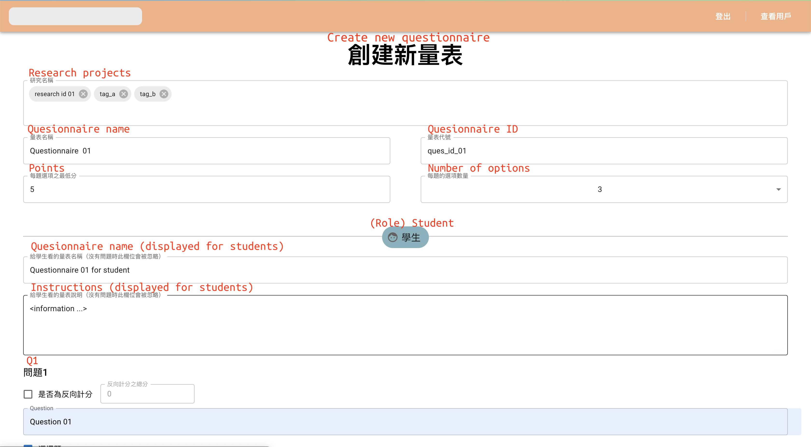

# Questionnaire System

This system is designed to facilitate researchers in the psychology department, assisting researchers to get rid of manually creating tons of Google Forms and recording thousands of respondents through excel files.

Researchers set up questionnaires, assigned them to respondents, and sent notification emails. Respondents fill them out afterward. The system enables researchers to manage and do statistics on them via this system.

Each questionnaire contains at most four-part, each part for one role (students, parents, teachers, counselors.) Every part has zero or multiple questions, which can be multiple-choice or essay questions.

There's an effective time for every questionnaire. It is possible for researchers to prepare questionnaires in advance and assign them to a group of respondents. These questionnaires will remain invisible and thus cannot be accessed until the effective time.

Functions provided:
* Questionnaire related: create, modify, delete, fill out, preview, export, assign to respondents, send notification emails

* Users related: register, login, check pending questionnaires, check questionnaire/user statistics

## Technical Stack

* Frontend: React, Redux, react-router-dom, styled-components, Formik, Yup, Material UI

* Backend: Go, Gin, Gorm, MySQL

* Host: AWS, Docker

## Demo

### Questionnaire page

### Main page

### Assign feature

### Notify feature

### Create page

### Preview feature

### User page

